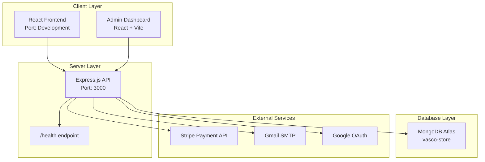
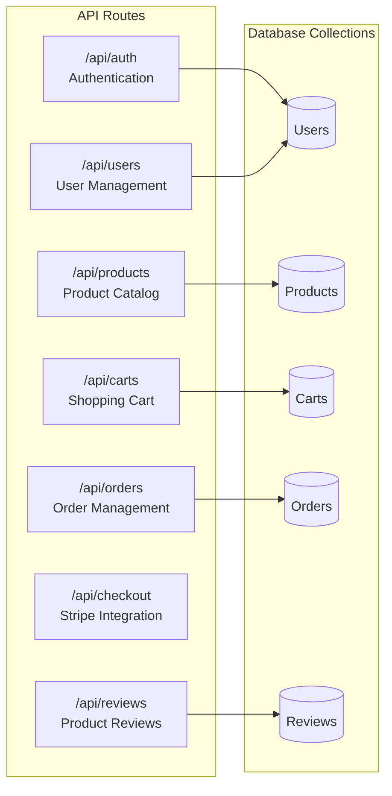
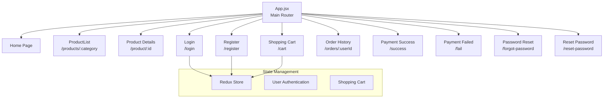

# VASCO - Premium Men's Clothing E-commerce Platform

VASCO is a full-stack e-commerce web application designed for a premium men's clothing brand, providing a complete online shopping experience with modern web technologies and secure payment processing.

## 🏗️ System Architecture



## 🛠️ Technology Stack

### Frontend Technologies
| Technology | Version | Purpose |
|------------|---------|---------|
| React | 18.2.0 | UI Framework |
| Redux | - | State Management |
| React Router | - | Client-side Routing |
| Styled Components | - | CSS-in-JS Styling |
| Material UI | - | UI Component Library |
| Vite | - | Build Tool & Dev Server |

### Backend Technologies
| Technology | Purpose |
|------------|---------|
| Node.js | Runtime Environment |
| Express.js | Web Framework |
| Mongoose | MongoDB ODM |
| JWT | Authentication |
| CORS | Cross-Origin Resource Sharing |

### Database & External Services
| Service | Purpose |
|---------|---------|
| MongoDB Atlas | Primary Database |
| Stripe API | Payment Processing |
| Google OAuth | Social Authentication |
| Gmail SMTP | Email Services |

## 📁 Project Structure

```
VASCO/
├── api/                          # Backend API Server
│   ├── index.js                  # Main server entry point
│   └── routes/                   # API route handlers
│       ├── auth.js              # Authentication routes
│       ├── user.js              # User management
│       ├── product.js           # Product catalog
│       ├── cart.js              # Shopping cart
│       ├── order.js             # Order management
│       ├── stripe.js            # Payment processing
│       └── review.js            # Product reviews
├── client/shopify/               # Frontend Application
│   └── src/
│       ├── App.jsx              # Main application component
│       ├── pages/               # Page components
│       └── redux/               # State management
└── admin/admin_side/             # Admin Dashboard
    └── src/
        ├── components/          # Reusable components
        └── pages/               # Admin pages
```

## 🔧 API Architecture [1](#0-0) 

The Express.js backend provides RESTful API endpoints organized by functionality:



## 🎯 Frontend Application Flow [2](#0-1) 

The React frontend implements a single-page application with the following page structure:



## 🗄️ Database Configuration [3](#0-2) 

The application connects to MongoDB Atlas with the database name `vasco-store` and implements proper error handling for database connections.

## 📊 Admin Dashboard Features [4](#0-3) 

The admin dashboard includes data visualization capabilities using Recharts library for:
- Sales performance tracking
- Product analytics
- Order management
- User statistics

## 🚀 Getting Started

### Prerequisites
- Node.js (v14 or higher)
- MongoDB Atlas account
- Stripe account for payments
- Gmail account for SMTP

### Installation

1. **Clone the repository**
```bash
git clone https://github.com/im-vishesh15th/VASCO.git
cd VASCO
```

2. **Backend Setup**
```bash
cd api
npm install
# Configure environment variables
npm start
```

3. **Frontend Setup**
```bash
cd client/shopify
npm install
npm run dev
```

4. **Admin Dashboard Setup**
```bash
cd admin/admin_side
npm install
npm run dev
```

### Environment Configuration
Create `.env` files with the following variables:
- MongoDB connection string
- Stripe API keys
- JWT secret
- Gmail SMTP credentials
- Google OAuth credentials

## 🔐 Security Features

- JWT-based authentication with automatic token expiry
- Password reset functionality with OTP verification
- Google OAuth integration
- CORS configuration for secure cross-origin requests
- Input validation and sanitization

## 📱 Responsive Design

The application implements responsive design patterns using:
- CSS media queries for mobile optimization
- Flexible grid layouts
- Mobile-first design approach

## 🧪 Health Monitoring [5](#0-4) 

The API includes a health check endpoint at `/health` for monitoring server status and uptime.

